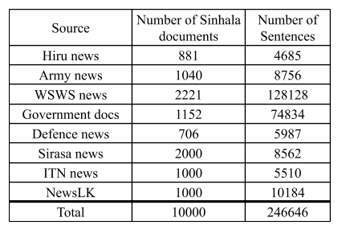
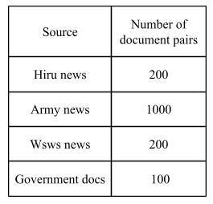

# TestData-CrossLingualDocumentSimilarityMeasurement
This repository contains the test data which is used for testing the cross lingual document similarity between Sinhala and English document pairs.
We scrape different websites and collect following documents.

## Sinhala Document Database
Sinhala document database consist with the following 10,000 Sinhala documents collected from eight different sources as shown in the below Table.

## Parallel Documents
Parallel document database consist with the following Sinhala and English document pairs collected from four different sources as shown in the below Table.

